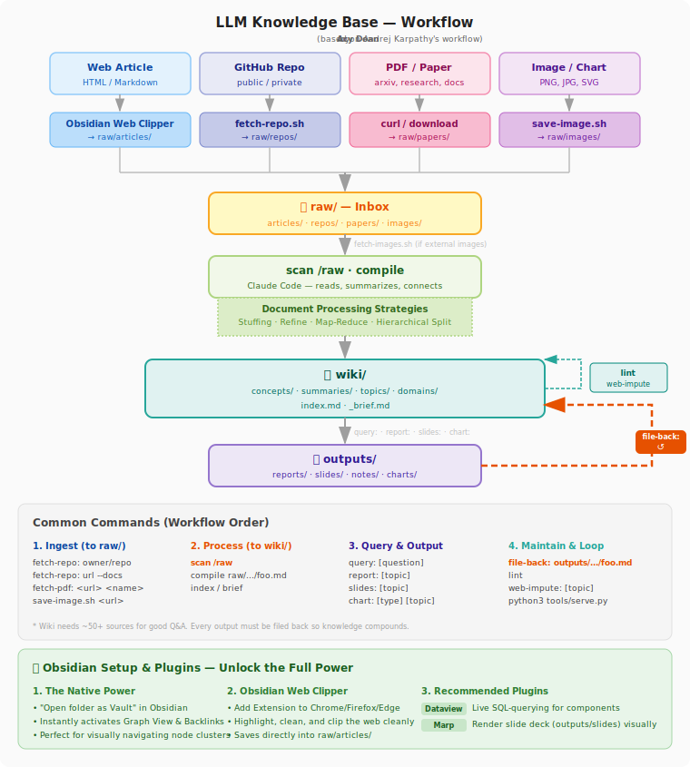

# LLM Knowledge Base System

A personal, AI-powered knowledge base — built on **Andrej Karpathy**'s workflow.

Core idea: **The LLM reads, summarizes, and connects knowledge for you.** You just feed it sources, ask questions, and get back reports.

---

## What does this system do?

| You do | The system does |
|--------|----------------|
| Clip an article from the web | Summarizes it, extracts concepts |
| Fetch a GitHub repo | Pulls README + metadata + file tree |
| Add a PDF paper | Analyzes it, connects it to existing knowledge |
| Ask a question | Answers based on the entire wiki |
| Request a report | Generates report/slides from multiple sources |

Once the wiki reaches ~50+ articles, the system starts surfacing **connections you hadn't noticed** across things you've already read.

---

## Workflow



---

## Directory Structure

```
/
├── raw/                    ← This is the "inbox" — drop sources here
│   ├── archived/           ← Original files (.pdf, .docx, etc.) after conversion
│   ├── articles/           ← Web articles (.md from Web Clipper)
│   ├── repos/              ← GitHub repos (.md from fetch-repo.sh)
│   ├── papers/             ← Academic papers (.pdf)
│   └── images/             ← Images downloaded to local
│
├── wiki/                   ← Organized knowledge
│   ├── index.md            ← Master index
│   ├── _brief.md           ← 1-page summary of the entire wiki (read before querying)
│   ├── concepts/           ← Atomic ideas, one concept per file
│   ├── summaries/          ← Per-document summaries from /raw
│   ├── topics/             ← Deep-dives on specific subjects
│   └── domains/            ← Maps of Content by knowledge domain
│
├── outputs/                ← Generated outputs
│   ├── reports/            ← Long-form reports
│   ├── slides/             ← Slideshows (Marp format)
│   ├── notes/              ← Quick notes
│   └── charts/             ← PNG charts
│
└── tools/                  ← Workflow support scripts
    ├── convert-docs.py     ← Core script: converts PDF/DOCX/PPTX to MD
    ├── convert.sh          ← Wrapper: auto-converts all binary files in raw/
    ├── compile-check.sh    ← Verifies all 9 compile steps completed
    ├── fetch-repo.sh       ← Fetches a GitHub repo into raw/repos/
    ├── file-back.sh        ← Tracks the feedback loop
    ├── impute.sh           ← Creates skeleton concept files for web-impute
    ├── scan.sh             ← Tracks ingest status
    ├── fetch-images.sh     ← Downloads external images from clipped articles (markdown + HTML)
    ├── save-image.sh       ← Downloads a single specific image
    ├── search.sh           ← Full-text search + fuzzy search across the wiki
    ├── lint.sh             ← Wiki health check (9 checks, noise-filtered)
    ├── chart.py            ← Generates PNG charts
    └── serve.py            ← Search UI in the browser
```

> `.lint-ignore-terms` (root) — allow-list for lint checks: add terms that don't need a concept file (people's names, phrases, headings).

---

## Step 1: Put content into `raw/`

Each source type has its own tool:

### Web articles — Obsidian Web Clipper (recommended)
1. Install the "Obsidian Web Clipper" extension on Chrome/Firefox
2. Set the save location to: `raw/articles/`
3. Clip an article → a `.md` file automatically appears in `raw/articles/`

### GitHub repos — fetch-repo.sh

Obsidian Web Clipper **cannot clip GitHub** (JS-heavy). Use the script instead:

```bash
./tools/fetch-repo.sh karpathy/nanoGPT
./tools/fetch-repo.sh https://github.com/anthropics/anthropic-sdk-python
./tools/fetch-repo.sh huggingface/transformers --docs    # also fetch the docs/ folder
./tools/fetch-repo.sh owner/repo --dry-run               # preview without fetching
```
→ Creates `raw/repos/owner-repo.md` with: metadata, README, file tree, and optionally docs/

Or use the Claude Code command:
```
fetch-repo: karpathy/nanoGPT
fetch-repo: https://github.com/anthropics/anthropic-sdk-python --docs
```

### PDFs / Word / Excel / PPTX — Auto Convert

The AI works best with plain text (`.md`). Office files and PDFs need to be converted to Markdown before the AI can compile them.

```bash
# Download a PDF
curl -L "https://arxiv.org/pdf/1706.03762" -o raw/papers/attention-is-all-you-need.pdf

# Auto-convert all binary files in the raw/ directory
./tools/convert.sh
```

After conversion, the original files (PDF/DOCX/...) are automatically moved into `raw/archived/` to keep things clean.

Or use the Claude Code command:
```
fetch-pdf: https://arxiv.org/pdf/1706.03762 attention-is-all-you-need
```

### Images / diagrams — save-image.sh

```bash
./tools/save-image.sh <url> [name] [--source "article name"]
```

---

## Step 2: Compile into the wiki

Open Claude Code in this directory and run:

```
scan /raw
```

Claude will automatically:
1. Check which files are new and haven't been compiled yet
2. Download any external images to local (if present)
3. Read and summarize each file
4. Create/update `wiki/summaries/`, `wiki/concepts/`, `wiki/domains/`
5. Update `wiki/index.md` and `wiki/_brief.md`
6. Mark each file as processed

To compile a specific file:
```
compile raw/articles/article-name.md
compile raw/repos/karpathy-nanoGPT.md
```

---

## Step 3: Ask questions and generate outputs

### Q&A from the wiki
```
query: explain [concept]
query: compare [A] and [B]
query: summarize everything about [topic]
query: find connections between [domain A] and [domain B]
```

> The wiki needs ~50+ articles before Q&A gives consistently good results. Early on, there will still be many gaps.

### Generate reports / slides
```
report: [topic]         → outputs/reports/report-topic-YYYY-MM-DD.md
slides: [topic]         → outputs/slides/slides-topic-YYYY-MM-DD.md  (Marp)
notes: [topic]          → outputs/notes/note-topic-YYYY-MM-DD.md
```

### Generate charts
```
chart: timeline [topic]
chart: bar [topic]
chart: network [topic]
```
See all chart types: `tools/.venv/bin/python3 tools/chart.py --list-types`

---

## Step 4: File Back (REQUIRED)

After every `report:` or `query:` that produces a new insight, run:

```
file-back: outputs/reports/report-name.md
```

Claude will:
1. Re-read the output
2. Identify insights that are new compared to the current wiki
3. Update `wiki/concepts/` or `wiki/summaries/` accordingly
4. Mark the output as filed back in the log

This is the **compound feedback loop** — every output makes the wiki smarter over time.

To see outputs that haven't been filed back yet:
```bash
./tools/file-back.sh --list
./tools/file-back.sh --verify outputs/reports/foo.md  # check if the wiki has been updated
./tools/file-back.sh --log      # history
./tools/file-back.sh --stats    # summary stats
```

---

## Step 5: Maintain the wiki

```
lint                    # check wiki health (broken links, missing concepts)
index                   # rebuild index.md and _brief.md from scratch
brief                   # update _brief.md only
```

---

## CLI Tools

### `fetch-repo.sh` — fetch a GitHub repo

```bash
./tools/fetch-repo.sh owner/repo               # fetch README + metadata + file tree
./tools/fetch-repo.sh owner/repo --docs        # also fetch the docs/ folder
./tools/fetch-repo.sh https://github.com/owner/repo
./tools/fetch-repo.sh owner/repo --dry-run     # preview without fetching
```
→ Output: `raw/repos/owner-repo.md`
→ No auth needed for public repos. Private repos require a `GITHUB_TOKEN` environment variable.

### `file-back.sh` — track the feedback loop

```bash
./tools/file-back.sh --list                               # outputs not yet filed back
./tools/file-back.sh --mark outputs/reports/foo.md        # mark manually
./tools/file-back.sh --mark outputs/reports/foo.md --note "added to concepts/bar.md"
./tools/file-back.sh --log                                # history
./tools/file-back.sh --stats                              # summary stats
```

### `scan.sh` — track ingest status

```bash
./tools/scan.sh --new                          # which files haven't been compiled
./tools/scan.sh --status                       # full table of all files
./tools/scan.sh --info raw/papers/paper.pdf    # check word count, suggested strategy
./tools/scan.sh --mark "raw/articles/foo.md"   # manually mark as compiled
```

### `convert.sh` — auto-convert binary documents

Converts PDF, DOCX, PPTX, XLSX files to `.md` format in preparation for compiling. The original files are moved to `raw/archived/` afterward.

```bash
./tools/convert.sh                           # convert all pending files in raw/
./tools/convert.sh "raw/papers/file.pdf"     # convert a single file
./tools/convert.sh --scan                    # just list files waiting to be converted
./tools/convert.sh --dry-run                 # parse and print to terminal (no files written)
```

### `fetch-images.sh` — download external images from clipped articles

When a clipped article has images as external URLs (not local), this script downloads them to `raw/images/` and rewrites the links in the file so Claude can read them.

```bash
./tools/fetch-images.sh raw/articles/foo.md           # download + rewrite
./tools/fetch-images.sh raw/articles/foo.md --dry-run # preview, don't download
```

> **Note:** Claude can read and describe local PNG/JPG images, but cannot fetch external URLs. Run this script before `scan /raw` if an article has important charts or diagrams.

### `save-image.sh` — download a single image

```bash
./tools/save-image.sh <url> [name] [--source "article name"]
```

### `search.sh` — search the wiki

```bash
./tools/search.sh "attention mechanism"        # full-text search
./tools/search.sh "align" --fuzzy              # fuzzy: also finds aligned/aligning/alignment
./tools/search.sh "transformer" --files        # return file paths only
./tools/search.sh --list-all                   # all wiki files
./tools/search.sh --related scaling-laws       # files related to a topic
```

### `serve.py` — browser-based search UI

```bash
python3 tools/serve.py
# → opens http://localhost:7337
```

### `lint.sh` — check wiki health

```bash
./tools/lint.sh                # run and print results
./tools/lint.sh --save         # save report to outputs/notes/
./tools/lint.sh --impute       # list missing concepts that need research
```

Lint checks 9 sections: broken links, orphan files, missing frontmatter, domain stats, tag clusters (detects potential new domains), stale MOCs, bridge note candidates.

> **Noise reduction**: The "missing concepts" check uses smart filtering (ASCII ratio, word count, allow-list).
> Add terms to `.lint-ignore-terms` (root) to exclude them from the check.

### `compile-check.sh` — verify after compiling

```bash
./tools/compile-check.sh "raw/articles/foo.md"   # run after `scan /raw` or `compile`
```

Automatically checks all 9 compile steps: scan-log, images, summary, concepts, domain MOC, index, _brief, mark. Outputs a table with ✅/⚠️/❌.

### `impute.sh` — create skeleton concept files for web-impute

```bash
./tools/impute.sh "mixture of experts"         # creates wiki/concepts/mixture-of-experts.md
./tools/impute.sh "KV Cache" --domain ai       # specify the domain
./tools/impute.sh --list                       # list already-imputed concepts (confidence: low)
```

Generates a correctly formatted frontmatter, sets `confidence: low`, adds `[needs verification]` placeholders, and auto-detects the domain from the name.
The AI just fills in the content — no need to worry about formatting.

### `chart.py` — generate charts

```bash
tools/.venv/bin/python3 tools/chart.py --type timeline \
  --data '{"2017":"Transformer","2020":"GPT-3","2022":"ChatGPT"}' \
  --title "LLM Timeline" --out llm-timeline

tools/.venv/bin/python3 tools/chart.py --list-types   # see all chart types
```
Output is saved to `outputs/charts/`.

---

## Wiki Structure

### `wiki/index.md`
Master index of all concepts, topics, and summaries. Updated automatically after each compile.

### `wiki/_brief.md`
A one-page summary of the entire wiki — Claude reads this before answering any query. This is the most important file for getting good Q&A results.

### `wiki/concepts/`
Each file is one atomic concept. Examples:
- `scaling-laws.md` — how capability scales with compute
- `ai-alignment.md` — ensuring AI does what humans intend
- `rlvr.md` — Reinforcement Learning from Verifiable Rewards (2025)
- `vibe-coding.md` — programming using natural language

### `wiki/summaries/`
Per-document summaries of everything ingested. Links to related concepts and domains.

### `wiki/domains/`
Maps of Content — entry points organized by knowledge domain. Domains **don't need to be designed upfront** — create one when you naturally have ≥10 concepts in the same area. Run `lint` to automatically detect potential new domains.

### `wiki/topics/`
Deep-dives on specific subjects, synthesizing multiple concepts.

---

## Scale Expectations

| Stage | Wiki size | Capability |
|-------|-----------|-----------|
| Early | ~10–30 articles | Basic Q&A, still many gaps |
| Growing | ~50–100 articles | Good Q&A, connections start to emerge |
| Mature | ~100+ articles / ~400K words | Multi-hop reasoning, complex synthesis |
| Advanced | Large | Consider synthetic data + fine-tuning |

---

## Obsidian Setup (optional)

Obsidian is the best viewer for this wiki — it supports graph view, backlinks, and Dataview queries.

1. Obsidian → "Open folder as vault" → select this directory (root)
2. Plugin status:

| Plugin | Status | How to use |
|--------|--------|-----------|
| **Obsidian Web Clipper** (browser ext) | Install separately on Chrome/Firefox | Clip web pages → auto-saves to `raw/articles/` |
| **Marp Slides** | ✅ Installed | Open a file in `outputs/slides/` → `Cmd+P` → "Marp Slides: Open Preview" |
| **Dataview** | ✅ Installed | Renders ` ```dataview``` ` blocks automatically — see examples at `wiki/dataview-examples.md` |
| **Graph View** | ✅ Built-in | `Cmd+G` — instantly shows the full wiki network |
| **Graph Analysis** | Not installed | Optional — cluster analysis, centrality |

### Dataview — sample queries

````
```dataview
TABLE source, created FROM "wiki/summaries"
SORT created DESC
```
````

````
```dataview
LIST FROM "wiki/concepts"
WHERE contains(tags, "ai-safety")
```
````

See full examples at [wiki/dataview-examples.md](wiki/dataview-examples.md).

### Marp Slides — export

```bash
npm install -g @marp-team/marp-cli          # install once
marp outputs/slides/file-name.md --html      # export to HTML
marp outputs/slides/file-name.md --pdf       # export to PDF
```

---

## Operating Principles

1. **The LLM writes the wiki, you curate** — don't edit wiki files manually
2. **Always file back outputs** — every report/query makes the wiki smarter
3. **Don't design domains upfront** — create a domain MOC when you naturally have ≥10 notes
4. **No RAG needed at small scale** — at ~400K words, the LLM navigates via the index
5. **Each source type has its own tool** — Web Clipper (articles), fetch-repo.sh (GitHub), curl (PDFs)
6. **file-back is mandatory** — this is the loop that makes knowledge compound over time

---

## Configuration Files

| File | Purpose |
|------|---------|
| `CLAUDE.md` | Setup guide and commands for **users** |
| `AGENTS.md` | Detailed instructions for **Claude** when executing (don't edit unless you want to change behavior) |
| `workflow.svg` | Workflow diagram — embedded in README |
